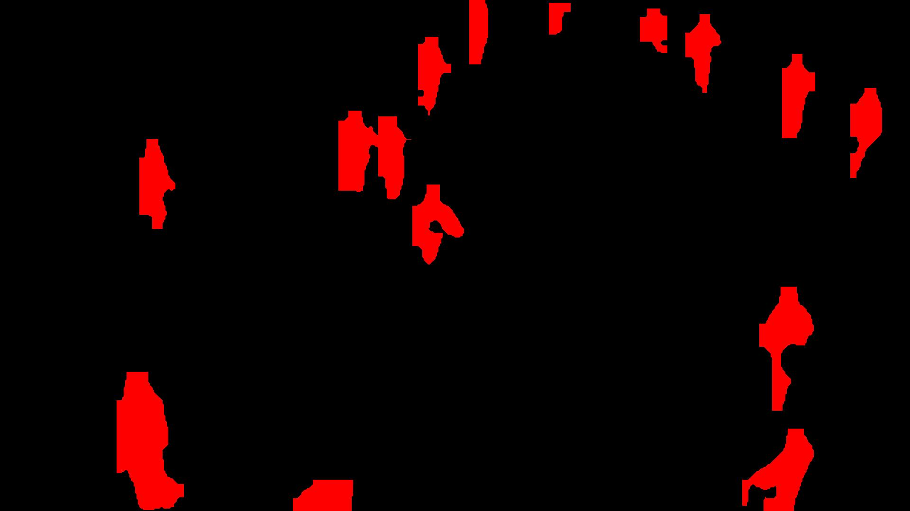
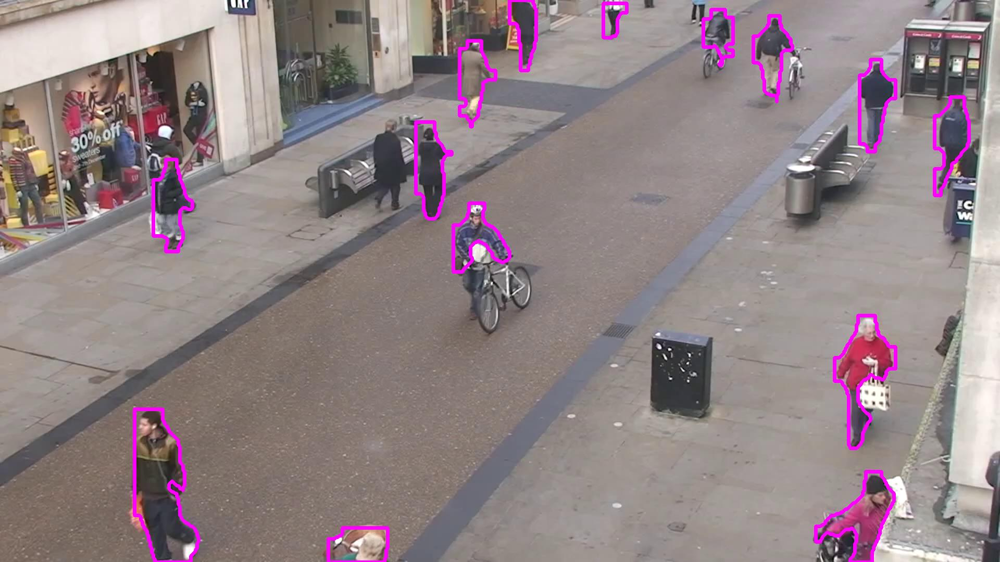
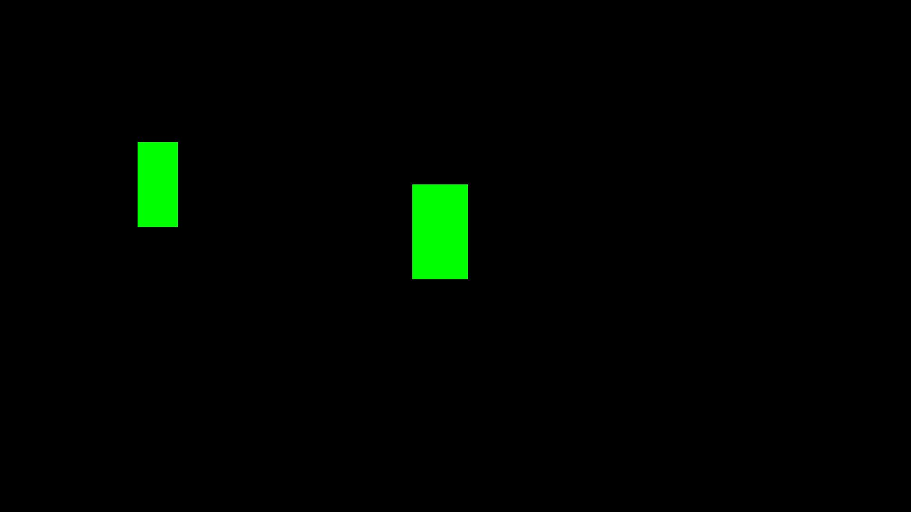
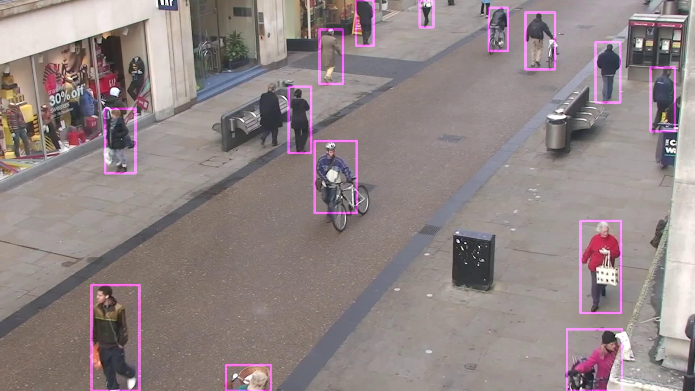

## YOLO Processing Functions Documentation

### `process_results_to_masks`

Generates a binary mask of specified objects, highlighting them in white and leaving the background in black.

#### **Parameters**:
- `results` (list): Detection results from the YOLO model.
- `frame` (np.array): Original image frame.
- `classes` (list or int, optional): Filter objects by their class IDs.
- `ids` (list or int, optional): Filter objects by their unique IDs.
- `color` (tuple, optional): RGB color for the mask.
- `thickness` (int, optional): Thickness of the outline.

#### **Code Example**:
```python
results = model.track(video_frames[0], persist=True, verbose=False)

# Sample code for process_results_to_masks
processed_frame = process_results_to_masks(results, processed_frame, classes=[0], ids=[], color=(255, 0, 0), thickness=-1)
```



#### **Advanced Code Example**:
```python
# Sample code for process_results_to_masks and combining it with the original frame
results = model.track(video_frames[0], persist=True, verbose=False)

mask = process_results_to_masks(results, processed_frame, classes=[0], ids=[], color=(255, 0, 255), thickness=5)
processed_frame = combine_images_with_mask(processed_frame, mask)
```



---

## YOLO Processing Functions Documentation

### `process_results_to_boxes`

Draws bounding boxes on a mask based on detection results, highlighting specified objects.

#### **Parameters**:
- `results` (list): Detection results from the YOLO model.
- `frame` (np.array): Original image frame.
- `classes` (list or int, optional): Filter objects by their class IDs.
- `ids` (list or int, optional): Filter objects by their unique IDs.
- `color` (tuple, optional): RGB color for the mask.
- `thickness` (int, optional): Thickness of the outline.

#### **Code Example**:
```python
results = model.track(video_frames[0], persist=True, verbose=False)

# Sample code for process_results_to_masks only making masks for person (0) with ids 10 and 6
processed_frame = process_results_to_boxes(results, processed_frame, classes=[], ids=[10, 6], color=(0, 255, 0), thickness=-1)
```



#### **Advanced Code Example**:
```python
# Sample code for process_results_to_masks and combining it with the original frame with transparency
results = model.track(video_frames[0], persist=True, verbose=False)

mask = process_results_to_boxes(results, processed_frame, classes=[0], ids=[], color=(255, 0, 255), thickness=5)
processed_frame = combine_images_with_transparency(processed_frame, mask, 0.5)
```



---

