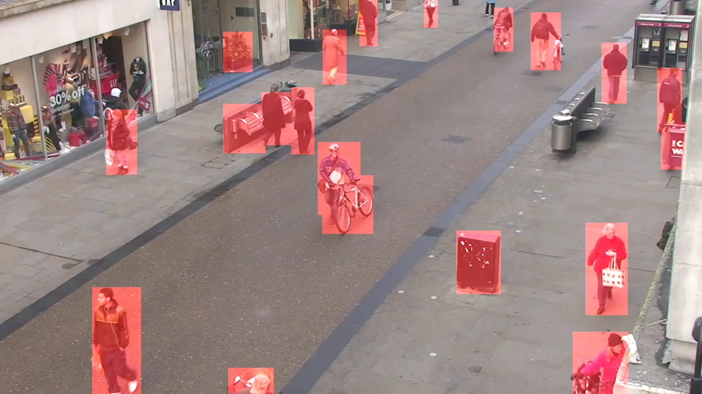

# YOLO11 Tacking & Functions

See `examples/yolo11_tracking.ipynb` to see how to use YOLO11-Segmentation with the code provided in the course.

In general to track objects using YOLO we need to load model, run the tracking and plot the results.

```python
# Load the video
video_frames, fps, duration = get_video_frames("Town.mp4", start=0, end=5)

# Prepare Model
model = YOLO("yolo11n-seg.pt")  # Load an official Segment model

# List all classes of the model and their index
print(model.names)

# Empty list of processe frames
processed_frames = []

# Iterate frames
for current_frame in video_frames:
    # Tacking is enables through the persist flag
    # You can limit the classes tracked by adding classes=0 (or any number in model.names)
    # Multiple classes can be tracked with classes=[0, 3, ...] 
    # Having no classes parameter tracks all classes that are part of the model
    results = model.track(current_frame, persist=True, verbose=False)

    # Results come as a list, we are only interested in the first entry thus index 0 
    # Plot results with labels, boxes, masks and probabilities
    # More information here: https://docs.ultralytics.com/modes/predict#plot-method-parameters
    processed_frame = resutls[0].plot(labels=True, boxes=True, masks=True, probs=True)

    # Append frame tipynbo new video
    processed_frames.append(processed_frame)

# Save the video back
save_video_frames(processed_frames, "yolo11_tracking.mp4", fps, displayVideo=False)
```


## Masks and Boxes

### `process_results_to_masks`

Generates a binary mask of specified objects, highlighting them in white and leaving the background in black.

#### **Parameters**:
- `results` (list): Detection results from the YOLO model.
- `frame` (np.array): Original image frame.
- `classes` (list or int, optional): Filter objects by their class IDs.
- `ids` (list or int, optional): Filter objects by their unique IDs.
- `color` (tuple, optional): RGB color for the mask.
- `thickness` (int, optional): Thickness of the outline.

#### **Code Example**:
```python
results = model.track(video_frames[0], persist=True, verbose=False)

# Sample code for process_results_to_masks
processed_frame = process_results_to_masks(results, processed_frame, classes=[0], ids=[], color=(255, 0, 0), thickness=-1)
```


#### **Advanced Code Example**:
```python
# Sample code for process_results_to_masks and combining it with the original frame
results = model.track(video_frames[0], persist=True, verbose=False)

mask = process_results_to_masks(results, processed_frame, classes=[0], ids=[], color=(255, 0, 255), thickness=5)
processed_frame = combine_images_with_mask(processed_frame, mask)
```


---


### `process_results_to_boxes`

Draws bounding boxes on a mask based on detection results, highlighting specified objects.

#### **Parameters**:
- `results` (list): Detection results from the YOLO model.
- `frame` (np.array): Original image frame.
- `classes` (list or int, optional): Filter objects by their class IDs.
- `ids` (list or int, optional): Filter objects by their unique IDs.
- `color` (tuple, optional): RGB color for the mask.
- `thickness` (int, optional): Thickness of the outline.

#### **Code Example**:
```python
results = model.track(video_frames[0], persist=True, verbose=False)

# Sample code for process_results_to_masks only making masks for person (0) with ids 10 and 6
processed_frame = process_results_to_boxes(results, processed_frame, classes=[], ids=[10, 6], color=(0, 255, 0), thickness=-1)
```


#### **Advanced Code Example**:
```python
# Sample code for process_results_to_masks and combining it with the original frame with transparency
results = model.track(video_frames[0], persist=True, verbose=False)

mask = process_results_to_boxes(results, processed_frame, classes=[0], ids=[], color=(255, 0, 255), thickness=5)
processed_frame = combine_images_with_transparency(processed_frame, mask, 0.5)
```


---


### `process_results_to_masks_normalized`

Creates a normalized binary mask (0 or 1 values) from detected objects, useful for further processing.

#### **Parameters**:
- `results` (list): Detection results from the YOLO model.
- `frame` (np.array): Original image frame.
- `classes` (list or int, optional): Filter objects by their class IDs.
- `ids` (list or int, optional): Filter objects by their unique IDs.

#### **Code Example**:
```python
results = model.track(processed_frame, persist=True, verbose=False)

# Sample code for process_results_to_masks_normalized
normalized_mask = process_results_to_masks_normalized(results, processed_frame, classes=[0])
processed_frame = normalized_mask * processed_frame
```


---


### `process_results_to_boxes_normalized`

Creates a normalized binary bounding boxes (0 or 1 values) from detected objects, useful for further processing.

#### **Parameters**:
- `results` (list): Detection results from the YOLO model.
- `frame` (np.array): Original image frame.
- `classes` (list or int, optional): Filter objects by their class IDs.
- `ids` (list or int, optional): Filter objects by their unique IDs.

#### **Code Example**:
```python
results = model.track(processed_frame, persist=True, verbose=False)

# Sample code for process_results_to_boxes_normalized
normalized_boxes = process_results_to_boxes_normalized(results, processed_frame, classes=[0])
processed_frame = normalized_boxes * processed_frame
```


---


## Points and Lines

### `process_results_to_center_points`

Extracts the center points of tracked objects as an array of coordinates [x0, y0, x1, y0, ... , xn, yn].

#### **Parameters**:
- `results` (list): Detection results from the YOLO model.
- `classes` (list or int, optional): Filter objects by their class IDs.
- `ids` (list or int, optional): Filter objects by their unique IDs.

#### **Code Example**:
```python
results = model.track(processed_frame, persist=True, verbose=False)

# Sample code for process_results_to_center_points
center_points = process_results_to_center_points(results, classes=[0])
processed_frame = draw_circles_from_points(center_points, processed_frame, radius=5, color=(0, 255, 0), thickness=-1)
```


#### **Advanced Code Example**:
```python
# Sample code for process_results_to_masks and combining it with the original frame with transparency
results = model.track(video_frames[0], persist=True, verbose=False)

center_points = process_results_to_center_points(results, classes=[0])
lines_frame = draw_lines_from_points(center_points, processed_frame, color=(255, 127, 0), thickness=3)
processed_frame = combine_images_with_transparency(processed_frame, lines_frame, 0.5)
```


---


### `process_results_to_center_points`

Extracts the center points of tracked objects as an array of coordinates [x0, y0, x1, y0, ... , xn, yn].

#### **Parameters**:
- `results` (list): Detection results from the YOLO model.
- `classes` (list or int, optional): Filter objects by their class IDs.
- `ids` (list or int, optional): Filter objects by their unique IDs.

#### **Code Example**:
```python
results = model.track(processed_frame, persist=True, verbose=False)

# Sample code for process_results_to_center_points
center_points = process_results_to_center_points(results, classes=[0])
processed_frame = draw_circles_from_points(center_points, processed_frame, radius=5, color=(0, 255, 0), thickness=-1)
```


#### **Advanced Code Example**:
```python
# Sample code for process_results_to_masks and combining it with the original frame with transparency
results = model.track(video_frames[0], persist=True, verbose=False)

center_points = process_results_to_center_points(results, classes=[0])
lines_frame = draw_lines_from_points(center_points, processed_frame, color=(255, 127, 0), thickness=3)
processed_frame = combine_images_with_transparency(processed_frame, lines_frame, 0.5)
```


---


### `process_results_to_masks_points`

Extracts the center points of tracked objects as an array of coordinates [x0, y0, x1, y0, ... , xn, yn].

#### **Parameters**:
- `results` (list): Detection results from the YOLO model.
- `classes` (list or int, optional): Filter objects by their class IDs.
- `ids` (list or int, optional): Filter objects by their unique IDs.

#### **Code Example**:
```python
results = model.track(processed_frame, persist=True, verbose=False)

# Sample code for process_results_to_masks_points
masks_points = process_results_to_masks_points(results, classes=[0])
processed_frame = draw_circles_from_points(masks_points, processed_frame, radius=5, color=(0, 255, 0), thickness=-1)
```


#### **Advanced Code Example**:
```python
# Sample code for process_results_to_masks and combining it with the original frame with transparency
results = model.track(video_frames[0], persist=True, verbose=False)

masks_points = process_results_to_masks_points(results, classes=[0])
lines_frame = draw_lines_from_points(masks_points, processed_frame, color=(255, 127, 0), thickness=3)
processed_frame = combine_images_with_transparency(processed_frame, lines_frame, 0.5)
```


---


### `process_results_to_boxes_points`

Extracts the center points of tracked objects as an array of coordinates [x0, y0, x1, y0, ... , xn, yn].

#### **Parameters**:
- `results` (list): Detection results from the YOLO model.
- `classes` (list or int, optional): Filter objects by their class IDs.
- `ids` (list or int, optional): Filter objects by their unique IDs.

#### **Code Example**:
```python
results = model.track(processed_frame, persist=True, verbose=False)

# Sample code for process_results_to_boxes_points
boxes_points = process_results_to_boxes_points(results, classes=[0])
processed_frame = draw_circles_from_points(boxes_points, processed_frame, radius=5, color=(0, 255, 0), thickness=-1)
```


#### **Advanced Code Example**:
```python
# Sample code for process_results_to_masks and combining it with the original frame with transparency
results = model.track(video_frames[0], persist=True, verbose=False)

boxes_points = process_results_to_boxes_points(results, classes=[0])
lines_frame = draw_lines_from_points(boxes_points, processed_frame, color=(255, 127, 0), thickness=3)
processed_frame = combine_images_with_transparency(processed_frame, lines_frame, 0.5)
```


---


### `process_results_to_labels`

Processes bounding box results to extract optional information such as IDs, class labels, and confidences. Can filter output based on specified IDs or classes.

#### **Parameters**:
- `results` (list): The results object containing bounding boxes.
- `model` (YOLO model): The model providing class names.
- `include_ids` (bool, optional): Whether to include bounding box IDs in the output. Defaults to `False`.
- `include_classes` (bool, optional): Whether to include class labels in the output. Defaults to `False`.
- `include_confidences` (bool, optional): Whether to include confidence scores in the output. Defaults to `False`.
- `ids` (list or int/float, optional): Filter for specific bounding box IDs. Defaults to `[]`.
- `classes` (list or int/float, optional): Filter for specific class IDs. Defaults to `[]`.

#### **Returns**:
- `list`: A list of formatted strings with the following format: `"id: {id} | class: {class} | confidence: {confidence}"`

#### **Code Example**:
```python
results = model.track(processed_frame, persist=True, verbose=False)

# Sample code for process_results_to_labels
labels = process_results_to_labels(results, model, include_ids=True, include_classes=True, include_confidences=True)
center_points = process_results_to_center_points(results, processed_frame)
processed_frame = draw_text_from_points(center_points, processed_frame, labels, fontScale=1)
```


#### **Advanced Example**:
```python
results = model.track(processed_frame, persist=True, verbose=False)

# Sample code for process_results_to_labels, get only id 6 and print confidence and class over the original frame
labels = process_results_to_labels(results, model, include_classes=True, include_confidences=True, ids=[6])
center_points = process_results_to_center_points(results, ids=[6])
text_frame = draw_text_from_points(center_points, processed_frame, labels, fontScale=1, color=(255, 0, 0), thickness=2)
processed_frame = combine_images_with_mask(processed_frame, text_frame)
```


---


### `draw_lines_from_points`

Draws lines connecting specified points on a blank frame, creating paths or shapes.

#### **Parameters**:
- `points` (np.array): Coordinates of points to connect.
- `frame` (np.array): Original or blank frame.
- `isClosed` (bool, optional): Whether to close the shape.
- `color` (tuple, optional): RGB color for lines.
- `thickness` (int, optional): Line thickness.

#### **Code Example**:
```python
results = model.track(processed_frame, persist=True, verbose=False)

# Sample code for draw_lines_from_points, drawing only between id 14 and 6
center_points = process_results_to_center_points(results, ids=[14, 6])
lines_frame = draw_lines_from_points(center_points, processed_frame, color=(127, 0, 255), thickness=3)
processed_frame = combine_images_with_mask(processed_frame, lines_frame)
```


---


### `draw_circles_from_points`

Draws circles at specified points on a blank frame, useful for highlighting specific locations.

#### **Parameters**:
- `points` (np.array): Coordinates of points where circles should be drawn.
- `frame` (np.array): Original or blank frame for drawing.
- `radius ` (int, optional): Radius of the circles. Defaults to 5.
- `color` (tuple, optional): RGB color for the circles. Defaults to (0, 255, 0).
- `thickness` (int, optional): Thickness of the circle outlines. Use -1 for filled circles. Defaults to -1.

#### **Code Example**:
```python
results = model.track(processed_frame, persist=True, verbose=False)

# Sample code for draw_lines_from_points, drawing a blue circle for ids 11, 13, 19
center_points = process_results_to_center_points(results, ids=[11, 13, 19])
lines_frame = draw_circles_from_points(center_points, processed_frame, color=(127, 200, 255), radius=20)
processed_frame = combine_images_with_mask(processed_frame, lines_frame)
```


---


### `draw_text_from_points`

Draws text labels at specified points on a blank frame.

#### **Parameters**:
 - `points` (np.array): Coordinates of points where text labels should be drawn.
 - `frame` (np.array): Original or blank frame for drawing.
 - `labels` (str or list): Text labels to be placed at the specified points. If a single string is provided, it is used for all points.
 - `fontFace` (int, optional): Font type for the text. Defaults to `cv2.FONT_HERSHEY_SIMPLEX`.
 - `fontScale` (float, optional): Scale of the text. Defaults to `2`.
 - `color` (tuple, optional): RGB color for the text. Defaults to `(0, 255, 0)`.
 - `thickness` (int, optional): Thickness of the text. Defaults to `4`.

#### **Code Example**:
```python
results = model.track(processed_frame, persist=True, verbose=False)

# Sample code for draw_lines_from_points, drawing a blue circle for ids 11, 13, 19 with the labels a, b and c
center_points = process_results_to_center_points(results, ids=[11, 13, 19])
labels = ["a", "b", "c"]
text_frame = draw_text_from_points(center_points, processed_frame, labels, fontScale=4, color=(255, 0, 0), thickness=4)
processed_frame = combine_images_with_mask(processed_frame, text_frame)
```


---


## Combining Images

### `combine_images_with_transparency`

Combines two images with adjustable transparency, where the second image (`b`) is overlaid on the first image (`a`) with transparency controlled by `t`.


#### **Parameters**:
 - `a` (np.array): Base image onto which the second image will be overlaid.
 - `b` (np.array): Image to overlay on the base image.
 - `t` (float): Transparency level for the overlay. Must be between `0.0` (completely transparent) and `1.0` (completely opaque).

#### **Code Example**:
```python
results = model.track(processed_frame, persist=True, verbose=False)

# Sample code for overlaying `b` onto `a` with 50% transparency
boxes_frame = process_results_to_boxes(results, processed_frame, color=(255, 0, 0))
processed_frame = combine_images_with_transparency(processed_frame, boxes_frame, 0.5)
```



---


### `combine_images_with_mask`

Combines two images by overlaying the non-black pixels of the second image (`b`) onto the first image (`a`).


#### **Parameters**:
 - `a` (np.array): Base image onto which the non-black pixels of the second image will be applied.
 - `b` (np.array): Overlay image whose non-black pixels will replace the corresponding pixels in the base image.

#### **Code Example**:
```python
results = model.track(processed_frame, persist=True, verbose=False)

# Sample code for overlaying `b` onto `a` with 50% transparency
boxes_frame = process_results_to_boxes(results, processed_frame, color=(255, 0, 0))
processed_frame = combine_images_with_transparency(processed_frame, boxes_frame)
```


---


## Miscellaneous

### `process_image_to_contours`

Processes an image to detect and draw contours, useful for edge detection and shape analysis.


#### **Parameters**:
 - `frame` (np.array): The input image (must be an RGB image).
 - `threshold` (int, optional): Threshold value for binary thresholding. Defaults to `127`.
 - `max_value` (int, optional): Maximum value for binary thresholding. Defaults to `255`.
 - `color` (tuple, optional): RGB color to use for drawing contours. Defaults to white `(255, 255, 255)`.
 - `thickness` (int, optional): Thickness of the contour lines. Defaults to `2`.

#### **Code Example**:
```python
processed_frame = process_image_to_contours(processed_frame, threshold=150, max_value=255, color=(0, 255, 0), thickness=3)
```


---

### `start_results_to_tracks`

Tracks detected objects over time and annotates their trajectories on a frame. The function allows filtering by object IDs or classes. Has to be started beforehand.

#### **Parameters for the tracking or `process_results_to_tacks`**:
 - `results` (list): The YOLO detection results object.
 - `frame` (np.array): The frame to annotate with tracks.
 - `max_tracks` (int, optional): Maximum number of historical points to draw for each track. Defaults to 30.
 - `color` (tuple, optional): RGB color for the track lines. Defaults to (230, 230, 230).
 - `thickness` (int, optional): Thickness of the track lines. Defaults to 5.
 - `ids` (list or int/float, optional): Filter for specific track IDs. Defaults to [].
 - `classes` (list or int/float, optional): Filter for specific object class IDs. Defaults to [].

#### **Code Example**:
```python
video_frames, fps, duration = get_video_frames("Town.mp4", start=0, end=5)

# Prepare Model
model = YOLO("yolo11n-seg.pt")  # Load an official Segment model

def process_video_frames(video_frames):
    previous_frame = np.zeros_like(video_frames[0])
    
    processed_frames = []

    ### Reset Ids ###
    if model.predictor is not None:
        model.predictor.trackers[0].reset_id()

    ### Start Tracker ###
    process_results_to_tacks = start_results_to_tracks()
    
    for index, current_frame in enumerate(tqdm(video_frames)):
        processed_frame = current_frame.copy()

        # Track the material
        results = model.track(processed_frame, persist=True, verbose=False)

        ### Calculations including the previous frame ####
        processed_frame = process_results_to_tacks(results, processed_frame)

        ##################################################
        
        previous_frame = processed_frame

        ### After Calculations with the previous frame ###


        ##################################################
        processed_frames.append(processed_frame)

    return processed_frames

processed_frames = process_video_frames(video_frames)

save_video_frames(processed_frames, "yolo_tracking.mp4", fps, displayVideo=False)
create_video_browser("/home/jovyan")
```


---
