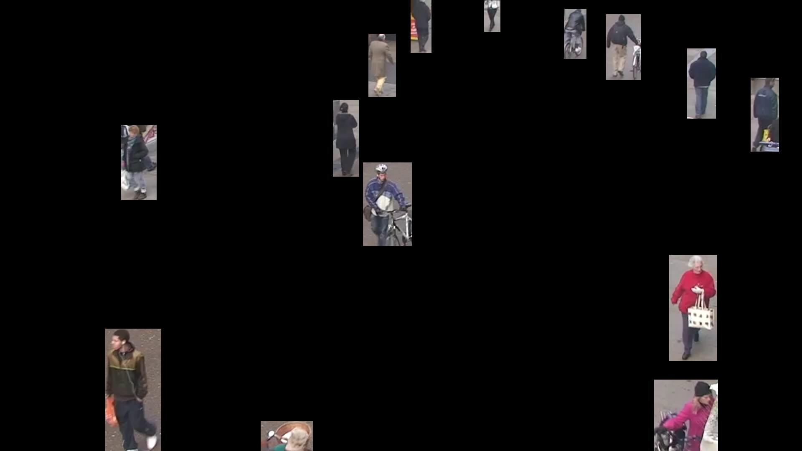
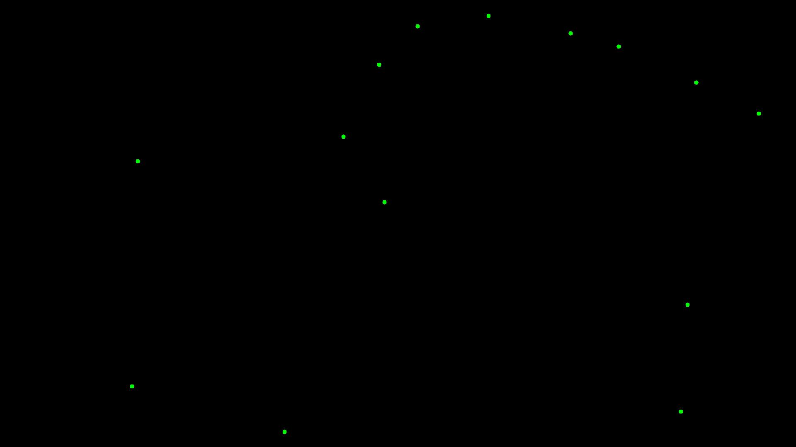

# YOLO Processing Functions Documentation

## Masks and Boxes

### `process_results_to_masks`

Generates a binary mask of specified objects, highlighting them in white and leaving the background in black.

#### **Parameters**:
- `results` (list): Detection results from the YOLO model.
- `frame` (np.array): Original image frame.
- `classes` (list or int, optional): Filter objects by their class IDs.
- `ids` (list or int, optional): Filter objects by their unique IDs.
- `color` (tuple, optional): RGB color for the mask.
- `thickness` (int, optional): Thickness of the outline.

#### **Code Example**:
```python
results = model.track(video_frames[0], persist=True, verbose=False)

# Sample code for process_results_to_masks
processed_frame = process_results_to_masks(results, processed_frame, classes=[0], ids=[], color=(255, 0, 0), thickness=-1)
```


#### **Advanced Code Example**:
```python
# Sample code for process_results_to_masks and combining it with the original frame
results = model.track(video_frames[0], persist=True, verbose=False)

mask = process_results_to_masks(results, processed_frame, classes=[0], ids=[], color=(255, 0, 255), thickness=5)
processed_frame = combine_images_with_mask(processed_frame, mask)
```


---


### `process_results_to_boxes`

Draws bounding boxes on a mask based on detection results, highlighting specified objects.

#### **Parameters**:
- `results` (list): Detection results from the YOLO model.
- `frame` (np.array): Original image frame.
- `classes` (list or int, optional): Filter objects by their class IDs.
- `ids` (list or int, optional): Filter objects by their unique IDs.
- `color` (tuple, optional): RGB color for the mask.
- `thickness` (int, optional): Thickness of the outline.

#### **Code Example**:
```python
results = model.track(video_frames[0], persist=True, verbose=False)

# Sample code for process_results_to_masks only making masks for person (0) with ids 10 and 6
processed_frame = process_results_to_boxes(results, processed_frame, classes=[], ids=[10, 6], color=(0, 255, 0), thickness=-1)
```


#### **Advanced Code Example**:
```python
# Sample code for process_results_to_masks and combining it with the original frame with transparency
results = model.track(video_frames[0], persist=True, verbose=False)

mask = process_results_to_boxes(results, processed_frame, classes=[0], ids=[], color=(255, 0, 255), thickness=5)
processed_frame = combine_images_with_transparency(processed_frame, mask, 0.5)
```


---


### `process_results_to_masks_normalized`

Creates a normalized binary mask (0 or 1 values) from detected objects, useful for further processing.

#### **Parameters**:
- `results` (list): Detection results from the YOLO model.
- `frame` (np.array): Original image frame.
- `classes` (list or int, optional): Filter objects by their class IDs.
- `ids` (list or int, optional): Filter objects by their unique IDs.

#### **Code Example**:
```python
results = model.track(processed_frame, persist=True, verbose=False)

# Sample code for process_results_to_masks_normalized
normalized_mask = process_results_to_masks_normalized(results, processed_frame, classes=[0])
processed_frame = normalized_mask * processed_frame
```


---


### `process_results_to_boxes_normalized`

Creates a normalized binary bounding boxes (0 or 1 values) from detected objects, useful for further processing.

#### **Parameters**:
- `results` (list): Detection results from the YOLO model.
- `frame` (np.array): Original image frame.
- `classes` (list or int, optional): Filter objects by their class IDs.
- `ids` (list or int, optional): Filter objects by their unique IDs.

#### **Code Example**:
```python
results = model.track(processed_frame, persist=True, verbose=False)

# Sample code for process_results_to_boxes_normalized
normalized_boxes = process_results_to_boxes_normalized(results, processed_frame, classes=[0])
processed_frame = normalized_boxes * processed_frame
```



---


## Points and Lines

### `process_results_to_center_points`

Extracts the center points of tracked objects as an array of coordinates [x0, y0, x1, y0, ... , xn, yn].

#### **Parameters**:
- `results` (list): Detection results from the YOLO model.
- `classes` (list or int, optional): Filter objects by their class IDs.
- `ids` (list or int, optional): Filter objects by their unique IDs.

#### **Code Example**:
```python
results = model.track(processed_frame, persist=True, verbose=False)

# Sample code for process_results_to_center_points
center_points = process_results_to_center_points(results, classes=[0])
processed_frame = draw_circles_from_points(center_points, processed_frame, radius=5, color=(0, 255, 0), thickness=-1)
```



#### **Advanced Code Example**:
```python
# Sample code for process_results_to_masks and combining it with the original frame with transparency
results = model.track(video_frames[0], persist=True, verbose=False)

center_points = process_results_to_center_points(results, classes=[0])
lines_frame = draw_lines_from_points(center_points, processed_frame, color=(255, 127, 0), thickness=3)
processed_frame = combine_images_with_transparency(processed_frame, lines_frame, 0.5)
```


---


### `process_results_to_center_points`

Extracts the center points of tracked objects as an array of coordinates [x0, y0, x1, y0, ... , xn, yn].

#### **Parameters**:
- `results` (list): Detection results from the YOLO model.
- `classes` (list or int, optional): Filter objects by their class IDs.
- `ids` (list or int, optional): Filter objects by their unique IDs.

#### **Code Example**:
```python
results = model.track(processed_frame, persist=True, verbose=False)

# Sample code for process_results_to_center_points
center_points = process_results_to_center_points(results, classes=[0])
processed_frame = draw_circles_from_points(center_points, processed_frame, radius=5, color=(0, 255, 0), thickness=-1)
```


#### **Advanced Code Example**:
```python
# Sample code for process_results_to_masks and combining it with the original frame with transparency
results = model.track(video_frames[0], persist=True, verbose=False)

center_points = process_results_to_center_points(results, classes=[0])
lines_frame = draw_lines_from_points(center_points, processed_frame, color=(255, 127, 0), thickness=3)
processed_frame = combine_images_with_transparency(processed_frame, lines_frame, 0.5)
```


---


### `process_results_to_masks_points`

Extracts the center points of tracked objects as an array of coordinates [x0, y0, x1, y0, ... , xn, yn].

#### **Parameters**:
- `results` (list): Detection results from the YOLO model.
- `classes` (list or int, optional): Filter objects by their class IDs.
- `ids` (list or int, optional): Filter objects by their unique IDs.

#### **Code Example**:
```python
results = model.track(processed_frame, persist=True, verbose=False)

# Sample code for process_results_to_masks_points
masks_points = process_results_to_masks_points(results, classes=[0])
processed_frame = draw_circles_from_points(masks_points, processed_frame, radius=5, color=(0, 255, 0), thickness=-1)
```


#### **Advanced Code Example**:
```python
# Sample code for process_results_to_masks and combining it with the original frame with transparency
results = model.track(video_frames[0], persist=True, verbose=False)

masks_points = process_results_to_masks_points(results, classes=[0])
lines_frame = draw_lines_from_points(masks_points, processed_frame, color=(255, 127, 0), thickness=3)
processed_frame = combine_images_with_transparency(processed_frame, lines_frame, 0.5)
```


---


### `process_results_to_boxes_points`

Extracts the center points of tracked objects as an array of coordinates [x0, y0, x1, y0, ... , xn, yn].

#### **Parameters**:
- `results` (list): Detection results from the YOLO model.
- `classes` (list or int, optional): Filter objects by their class IDs.
- `ids` (list or int, optional): Filter objects by their unique IDs.

#### **Code Example**:
```python
results = model.track(processed_frame, persist=True, verbose=False)

# Sample code for process_results_to_boxes_points
boxes_points = process_results_to_boxes_points(results, classes=[0])
processed_frame = draw_circles_from_points(boxes_points, processed_frame, radius=5, color=(0, 255, 0), thickness=-1)
```


#### **Advanced Code Example**:
```python
# Sample code for process_results_to_masks and combining it with the original frame with transparency
results = model.track(video_frames[0], persist=True, verbose=False)

boxes_points = process_results_to_boxes_points(results, classes=[0])
lines_frame = draw_lines_from_points(boxes_points, processed_frame, color=(255, 127, 0), thickness=3)
processed_frame = combine_images_with_transparency(processed_frame, lines_frame, 0.5)
```


---


### `process_results_to_labels`

Processes bounding box results to extract optional information such as IDs, class labels, and confidences. Can filter output based on specified IDs or classes.

#### **Parameters**:
- `results` (list): The results object containing bounding boxes.
- `model` (YOLO model): The model providing class names.
- `include_ids` (bool, optional): Whether to include bounding box IDs in the output. Defaults to `False`.
- `include_classes` (bool, optional): Whether to include class labels in the output. Defaults to `False`.
- `include_confidences` (bool, optional): Whether to include confidence scores in the output. Defaults to `False`.
- `ids` (list or int/float, optional): Filter for specific bounding box IDs. Defaults to `[]`.
- `classes` (list or int/float, optional): Filter for specific class IDs. Defaults to `[]`.

#### **Returns**:
- `list`: A list of formatted strings with the following format: `"id: {id} | class: {class} | confidence: {confidence}"`

#### **Code Example**:
```python
results = model.track(processed_frame, persist=True, verbose=False)

# Sample code for process_results_to_labels
labels = process_results_to_labels(results, model, include_ids=True, include_classes=True, include_confidences=True)
center_points = process_results_to_center_points(results, processed_frame)
processed_frame = draw_text_from_points(center_points, processed_frame, labels, fontScale=1)
```


#### **Advanced Example**:
```python
results = model.track(processed_frame, persist=True, verbose=False)

# Sample code for process_results_to_labels
labels = process_results_to_labels(results, model, include_classes=True, include_confidences=True, ids=[6])
center_points = process_results_to_center_points(results, processed_frame)
text_frame = draw_text_from_points(center_points, processed_frame, labels, fontScale=1, color=(255, 0, 0), thickness=1)
processed_frame = combine_images_with_mask(processed_frame, text_frame)
```

